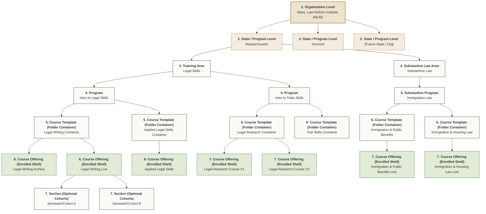

# Brightspace Administration & File Management Guide
*A standard operating procedure for a solo developer managing custom LACE HTML courses.*

As the sole developer on a non-technical team of attorneys, establishing a clear, structured pipeline for creating, updating, and organizing courses in Brightspace is critical. This guide documents Brightspace organizational best practices, folder hierarchies, and safe workflows to keep your files organized and prevent Brightspace from breaking your custom code.

---

## 1. Brightspace Hierarchy & MLRI Organizational Schema

Here is the structural schema mapped out for the **Massachusetts Law Reform Institute (MLRI)** Brightspace environment. It outlines the multi-tiered relationships from the top-level organization down to the individual course offerings and sections:



### Managing Templates vs. Offerings in LACE HTML Projects
Brightspace makes a strict technical distinction between a **Course Template** (parent container) and a **Course Offering** (the live classroom holding students). This distinction dictates how and where you organize your custom HTML, CSS, and JavaScript.

#### Option A: Storing LACE assets at the Course Template level
If you store the framework files (`course-style.css`, `course-nav.js`) at the **Course Template** level (e.g. inside `Legal Research Container`), they exist in a parent folder. 
*   **Pathing**: Child offerings (e.g., `Legal Research Course V1`) can access them by pointing upstream:
    ```html
    <link rel="stylesheet" href="../../shared/course-style.css">
    ```
*   **Pros**: Updating the stylesheet or nav script in the parent folder instantly updates both V1 and V2 offerings.
*   **Cons**: If you introduce a script syntax error while editing, it will instantly break all active child courses.

#### Option B: Storing assets at the Course Offering level (Recommended for Solo Developers)
Upload the complete LACE package (`course-config.js`, `course-style.css`, `course-nav.js`, and HTML content) directly inside the **Manage Files** directory of each individual **Course Offering**.
*   **Why?**:
    1.  **Isolation**: You can modify or test new scripts on the "Live" shell without risking breaking your "Archive" shells or separate version containers (like V1 vs V2).
    2.  **Clean Rollovers**: When you use Brightspace's "Copy Course Components" tool to clone an offering to a new semester, Brightspace automatically moves all files in the course directory. The links stay completely self-contained and intact.
    3.  **Config Autonomy**: Each offering needs its own `course-config.js` file (since each semester's course might have minor syllabus or topic date adjustments). Storing assets at the offering level keeps this relationship natural and clean.

---

## 2. File Organization Best Practices in Brightspace

When you open **Manage Files** in a Brightspace course, treat it like a clean local directory. Avoid dumping files in the root.

### Recommended Course Folder Structure:
```text
/Course-Files/ (Root)
│
├── Home.html                 <-- Course Home / Table of Contents
├── Modules.html              <-- Detailed Syllabus / Objectives
├── page-1-introduction.html  <-- Topic Page
├── page-2-court-rules.html   <-- Topic Page
├── page-3-filing-steps.html  <-- Topic Page
│
├── course-config.js          <-- Shared syllabus config (unique to this course)
├── course-style.css          <-- Shared LACE stylesheet
├── course-nav.js             <-- Shared navigation engine
├── LACE-UX-Recommendations.md <-- Backlog checklist
│
├── css/                      <-- (Optional) If you have extra specific stylesheets
├── js/                       <-- (Optional) If you have extra third-party libraries
├── images/                   <-- Screenshots, icons, diagrams
└── assets/                   <-- Flowcharts, PDFs, offline checklist downloads
```

> [!IMPORTANT]
> **CRITICAL RULE**: Always use **relative paths** (e.g., `href="course-style.css"` or `src="images/diagram.png"`). Never use absolute local disk paths (`C:\...`) or hardcoded LMS domain URLs, as these will break when the course is copied or imported.

---

## 3. Step-by-Step Workflow for a New Course

Follow this checklist whenever an attorney requests a new training course.

### Phase 1: Local Development & Configuration
1.  **Duplicate the Template**: Copy your local `Course-Template/` folder and name it after the new course (e.g., `Eviction-Defense-Course/`).
2.  **Generate a Unique Course ID**: Open `course-config.js` and change the `courseId` to a new slug (e.g., `eviction_defense_2026`). 
    *   *Why?* The progress engine uses `localStorage` bound to this ID. If two courses share the same `courseId`, a student's completion checks from Course A will mistakenly mark topics in Course B as complete!
3.  **Update Course Metadata**: Edit `courseTitle` and `courseSubtitle` in `course-config.js`.
4.  **Map out the Syllabus**: Define the modules, topic slugs, local `file` paths, placeholder `url` values, descriptions, and estimated reading durations in the `modules` array.
5.  **Create Topic Pages**: Copy `topic-template.html` to create your pages (e.g., `intro.html`). Update the `<meta name="course-slug">` tag in each file to match your config.
6.  **Keep `deployMode` set to `"local"` while drafting**: This tells `course-nav.js` to use each topic's `file` path, so the course works on your computer before Brightspace topic URLs exist.
7.  **Test Locally**: Open `Home.html` in your browser. Verify that the dynamic nav loads, progress saves for local testing, and the menu checks off items as you click through.

### Phase 2: Uploading to Brightspace
1.  **Zip the Folder**: Zip the files inside your local course folder (select the files directly and zip them, rather than zipping the parent folder, so files remain in the root of the archive).
2.  **Upload to LMS**:
    *   Go to your Brightspace Course Offering -> **Course Admin** -> **Manage Files**.
    *   Click **Upload**, select your zip file, and click save.
    *   Find the zip in the file list, click the dropdown arrow, and select **Unzip**. Delete the original `.zip` file to keep the folder clean.

### Phase 3: Building the Content Tree — A Deep Dive

Since MLRI wants full tracking abilities, build new production courses around **Architecture B: Dual Tracking** from the start.

Use this mental model:

| Layer | What it controls | What you do there |
| --- | --- | --- |
| **Manage Files** | The actual HTML, CSS, JS, images, and PDFs | Upload and overwrite files only |
| **Brightspace Content** | Official LMS topics, completion records, reports, and course progress | Create one Content topic for every trackable page |
| **LACE navigation** | The learner-facing menu, previous/next buttons, and calm page flow | Point `course-config.js` at Brightspace topic URLs |

> [!IMPORTANT]
> **Manage Files and Course Builder are separate.** Deleting a file from **Manage Files** does not delete the matching topic/node from **Course Builder** or **Content**. The node can remain in the outline as a broken placeholder until you remove, replace, or reattach it there too. If the page is still part of the course, overwrite the file in Manage Files. If the page is no longer part of the course, remove the Course Builder/Content node as well.

For full tracking, every page that should count as complete must be a Brightspace Content topic. The LACE menu should not link directly to `topic-1.html` in production; it should link to the Brightspace topic URL for that page. That is how Brightspace sees the visit and records completion.

#### Full-Tracking Build Order

1.  **Build locally first.** Keep `deployMode: "local"` while drafting pages. Use the `file` field for each topic so links work on your machine.
2.  **Upload the course package.** Upload `Home.html`, `Modules.html`, all topic pages, `course-config.js`, `course-style.css`, `course-nav.js`, images, and assets to the Course Offering's Manage Files area.
3.  **Create Brightspace Content topics.** In the visible Content structure, add one topic for every page that should be tracked.
4.  **Set completion tracking.** Set each trackable topic to **Automatic: Visited** only when a visit is enough evidence. For videos or required learning checks, use a stricter completion method such as H5P interaction, embedded check-in question, short quiz, reflection, completion condition, or manual mark-complete step.
5.  **Copy topic URLs.** Open each Brightspace topic and copy its `/d2l/le/content/.../viewContent/.../View` URL.
6.  **Map URLs in `course-config.js`.** Keep each topic's local `file` path, but paste the Brightspace topic URL into its `url` field.
7.  **Switch to LMS mode.** Set `deployMode: "lms"` and re-upload `course-config.js`.
8.  **Test as a learner.** Use a student/test account, click through with LACE navigation, and confirm Brightspace marks topics complete in its own reports.

#### Recommended Student-Facing Page Structure

Use Brightspace's Content tree as the official reporting structure, but keep it simple and predictable.

| Brightspace module/topic | File it points to | Completion | Student purpose |
| --- | --- | --- | --- |
| Start Here / Course Home | `Home.html` | Optional or Automatic: Visited | Launches the LACE course experience |
| Module 1 / Topic 1 | `topic-1.html` | Automatic: Visited | Trackable learning page |
| Module 1 / Topic 2 | `topic-2.html` | Automatic: Visited | Trackable learning page |
| Module 2 / Topic 3 | `topic-3.html` | Automatic: Visited | Trackable learning page |
| Resources / Download | PDF or resource page | Usually optional | Support material, tracked only if needed |

Do not create duplicate visible paths to the same required page. If learners can reach the same page through two different Brightspace topics, reporting becomes harder to interpret.

This is the most important and nuanced part of running custom HTML inside Brightspace. Understanding *how* your pages get loaded — and what that means for completion tracking — will save you a lot of confusion.

---

#### First: How Does Brightspace Load Your HTML Pages?

When a learner clicks a topic in Brightspace's Content sidebar, Brightspace loads your HTML file **inside an `<iframe>`** embedded in the LMS chrome. This is important because it means:

- The learner sees your `Home.html` rendered inside a Brightspace page, surrounded by the LMS header, sidebar, footer etc.
- The URL in the browser bar is a **Brightspace URL** (e.g. `https://mlri.brightspace.com/d2l/le/content/6698/viewContent/...`), *not* your HTML file's URL directly.
- Brightspace only registers a page visit as "Complete" when its own content topic URL is loaded by the browser.

```
┌─────────────────────────────────────────────────────────┐
│  Brightspace Chrome (LMS header, sidebar, footer)       │
│                                                         │
│  ┌──────────────────────────────────────────────────┐   │
│  │  <iframe>                                        │   │
│  │                                                  │   │
│  │     Your Home.html renders here                  │   │
│  │     course-style.css ✓                           │   │
│  │     course-nav.js ✓                              │   │
│  │                                                  │   │
│  └──────────────────────────────────────────────────┘   │
└─────────────────────────────────────────────────────────┘
```

---

#### The Two Completion Tracking Architectures

You have two viable approaches. Choose **one** per course and stick with it.

---

##### ✅ Architecture A: LACE-Only Tracking (Prototype or Low-Stakes Only)

**How it works:** You use `localStorage` (built into `course-nav.js`) as your *sole* progress tracker. Brightspace's Content tree is used only as a delivery mechanism — it holds topic links so Brightspace can load your pages, but you don't rely on the LMS for completion data.

**Content Tree Setup:**
1. In your Brightspace Course Offering, go to **Content**.
2. Create one module called **Course Content** (or any internal name — students won't see it).
3. For **every** HTML page (Home, Modules, each topic), click **New → Add from Manage Files** and select the file. Brightspace creates a topic entry for each one.
4. Set **all topics** to **Hidden** or **Draft** — *including* `Home.html`. Students will *not* navigate via this sidebar at all.
5. Create a **second module** called **Start Here** with a single visible link. This is the only thing students see in the sidebar. Make this link point to your `Home.html` file, but use the **full course-file URL with the clean-view parameter** appended:
   ```
   https://mlri.brightspace.com/content/enforced/{orgUnitId}/Home.html?ou={orgUnitId}&d2l_body_type=3
   ```
   This strips the Brightspace chrome entirely and loads your `Home.html` full-screen, so your LACE nav is the *only* navigation students see.

**Pros:**
- Simplest to set up and maintain.
- Your `course-nav.js` progress engine handles everything.
- Students get a seamless, clean experience with zero Brightspace chrome.
- Adding a new topic page = just upload the file and add one line to `course-config.js`. No Brightspace admin work needed.

**Cons:**
- Progress only lives in the browser's `localStorage`. If a student switches browsers, clears cache, or uses a different device, their progress resets.
- Brightspace **grade book and completion reports** will show 0% for all students, because the LMS never sees individual topic visits.

> [!IMPORTANT]
> **When to choose Architecture A:** Use this only for prototypes, demos, or low-stakes courses where MLRI does not need formal completion records. Because the goal is full tracking, do not use Architecture A for production courses that require reporting.

---

##### ⚙️ Architecture B: Dual Tracking (LACE + Native LMS Completions)

**How it works:** You keep all the LACE visual navigation *and* wire up Brightspace's native completion tracking so that when a student visits a topic, Brightspace also records it in its grade book and completion reports.

**The Key Challenge:** When your `Home.html` runs inside Brightspace's iframe and a student clicks **Next →**, your `course-nav.js` navigates the `<iframe>` to the next HTML file. But Brightspace's parent window doesn't know this happened — so it never marks the topic complete in its own system.

**The Solution:** Instead of linking directly to your HTML files in `course-config.js`, you link to the **Brightspace content topic URLs** for each page. When `course-nav.js` intercepts a click on one of these Brightspace URLs, it fires the navigation at the **parent window** (which is the Brightspace chrome), not just the iframe. This makes the LMS load the new topic properly — registering the visit in its completion system — while your HTML file renders inside the freshly loaded iframe.

> [!NOTE]
> This is exactly what the **Iframe Navigation Interceptor** added to `course-nav.js` handles automatically. When it detects a `/d2l/le/content/` URL being clicked while inside an iframe, it redirects `window.parent` instead of `window`.

**Content Tree Setup:**

1. In your Brightspace Course Offering, go to **Content**.
2. Create your module structure (e.g. **Module 1 · Getting Started**).
3. For each topic page, click **New → Add from Manage Files** and select the HTML file. Brightspace creates a topic entry with a URL like:
   ```
   https://mlri.brightspace.com/d2l/le/content/6698/viewContent/88421/View
   ```
4. Set the **Completion Method** for each topic to **Automatic: Visited**. (Click the topic → Settings dropdown → Completion Tracking.)
5. **Do not hide these topics** — Brightspace needs them to be active to register visits.
6. Now go to each topic's Brightspace URL and copy it. Paste these **Brightspace topic URLs** (not your HTML file paths) into `course-config.js` as the `url` field for each topic:

```javascript
// course-config.js — Architecture B URL format
topics: [
  {
    slug: "intro",
    title: "Introduction",
    // Use the Brightspace content topic URL, not the raw HTML file path
    url: "https://mlri.brightspace.com/d2l/le/content/6698/viewContent/88421/View",
    duration: "3 min read"
  },
  {
    slug: "topic-1",
    title: "Topic 1: Essential Concepts",
    url: "https://mlri.brightspace.com/d2l/le/content/6698/viewContent/88422/View",
    duration: "5 min read"
  }
]
```

7. The Iframe Interceptor in `course-nav.js` detects that these are `/d2l/le/content/` URLs and fires them at `window.parent` automatically. No further code changes needed.

**Pros:**
- Brightspace grade book, completion reports, and dashboards all work as normal.
- Progress is stored server-side in the LMS — survives browser clears and device switches.
- Administrators and supervisors can run standard Brightspace completion reports on attorneys.

**Cons:**
- More setup work per course (you must copy each Brightspace topic URL into `course-config.js`).
- If you add a new topic, you must create it in the Brightspace Content tree first, copy its URL, *then* add it to the config.
- Topic URLs are **course-specific** and will break if the course is copied to a new offering without updating the config. You must update `course-config.js` with fresh topic URLs after every course copy/rollover.

> [!IMPORTANT]
> **When to choose Architecture B:** If your organization needs formal CLE records, LMS completion certificates, compliance reporting, or supervisor dashboards showing attorney training completion — Architecture B is the right choice despite its additional overhead.

---

#### Side-by-Side Comparison

| Feature | Architecture A (LACE Only) | Architecture B (Dual Tracking) |
|---|---|---|
| Setup complexity | ⭐ Low | ⭐⭐⭐ High |
| Maintenance per new topic | Just update `course-config.js` | Create LMS topic + update config |
| Survives device/browser switch | ❌ No | ✅ Yes (LMS stores server-side) |
| LMS grade book support | ❌ No | ✅ Yes |
| Completion reports for admins | ❌ No | ✅ Yes |
| Clean full-screen experience | ✅ Yes (`?d2l_body_type=3`) | ⚠️ Partial (LMS chrome visible) |
| Course rollover complexity | ⭐ Easy | ⭐⭐⭐ Must re-copy all topic URLs |

> [!TIP]
> **Recommended approach for MLRI right now:** Use **Architecture B** for production courses. It takes more setup, but it preserves Brightspace's native completion reports, survives device changes, and supports future CLE/compliance workflows. Use Architecture A only as a local drafting mode or quick demo mode.

---

## 4. Maintenance & Updates Workflow (The "Overwriting" Rule)

> [!CAUTION]
> **NEVER EDIT HTML FILES USING BRIGHTSPACE'S NATIVE WYSIWYG EDITOR.**
> Brightspace's rich text editor strips out custom JavaScript `<script>` tags, deletes header `<meta>` tags, strips CSS resets, and modifies inline container classes. If you edit a page inside Brightspace, it will break your LACE navigation instantly.

### How to Safely Update Course Content:
Always perform updates locally and push files to the LMS using file overwrites:

1.  **Edit Locally**: Open the file (e.g., `intro.html` or `course-config.js`) in VS Code or your local text editor.
2.  **Save & Push to Git**: Commit your changes to Git. This ensures you have a revision history in case an update breaks things and you need to roll back.
3.  **Upload & Overwrite**:
    *   Go to Brightspace -> **Manage Files**.
    *   Click **Upload** and upload only the modified file.
     *   Brightspace will alert you that the file already exists. Select **Overwrite**.
     *   *Tip*: Clear your browser cache (`Ctrl + F5` or CMD + Shift + R) to view the changes immediately.
4.  **If you intentionally remove a page**:
    *   Delete the file from **Manage Files** only after confirming it is no longer needed.
    *   Go to **Course Builder** or **Content** and remove the matching topic/node.
    *   Re-check the course outline. Broken nodes will appear in the API as `IsBroken: true` or with a missing URL.
    *   Do not sync broken topics into the LACE catalog or reporting layer.

  ---

## 5. Ingestion Pipeline for Non-Technical Attorneys

Attorneys will supply content in Microsoft Word docs, PDFs, or emails. Use this ingestion workflow to protect your time and keep layouts consistent:

### Step 1: Provide a Ingestion Template
Give attorneys a simple Word template or structure. Ask them to write content in standard text, but use bracketed highlights for visual blocks. E.g.:
> `[CALLOUT SAGE: Make sure the tenant signs the answer form before 5:00 PM on the 5th day.]`
>
> `[ACCORDION: FAQ - What if the landlord refuses rent?]`
> `Answer text goes here...`

### Step 2: Code Assembly
1. Copy the raw text from their Word document.
2. Paste it into your local HTML page cloned from `topic-template.html`.
3. Wrap their bracketed callouts or lists in LACE CSS components:
   * Bracketed warnings go inside `<div class="callout callout-rust">`.
   * Frequently Asked Questions go inside the `<div class="accordion-item">` container.
   * Multi-part comparison text goes inside the `<div class="tabs-container">` tabs.

### Step 3: Local QA & Review
Open the completed page locally. Take a screenshot or show it to them in a local web preview before uploading to the LMS. Once they sign off, upload it to Brightspace via **Manage Files** (overwriting the file) and link it in Content.
